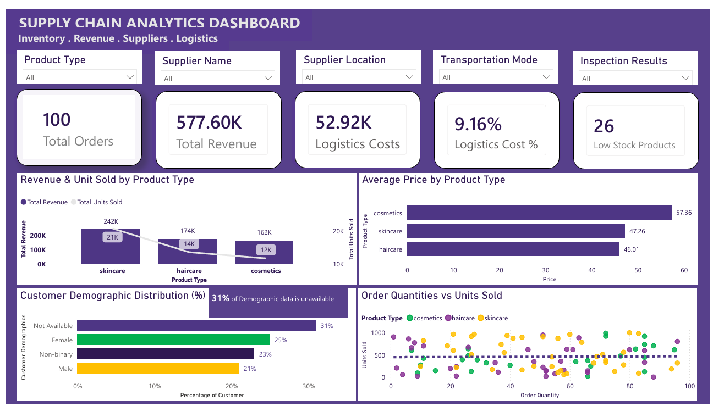

# Logistics & Supply Chain Analytics

## Improving Delivery Performance While Reducing Operational Costs

An end-to-end **Logistics & Supply Chain Analytics** project using
**SQL, Power BI, and business analysis** to evaluate inventory risk,
supplier performance, transportation costs, lead times, and logistics
efficiency.

The project transforms a 100-record supply-chain dataset into an
interactive three-page Power BI dashboard supported by SQL-based data
preparation, exploratory analysis, business insights, and operational
recommendations.

------------------------------------------------------------------------

## 📊 Project Overview

Supply-chain teams need to balance **inventory availability, delivery
speed, supplier reliability, and logistics cost**.

This project analyzes those trade-offs to answer questions such as:

-   Which products require inventory replenishment?
-   Which product categories generate the strongest demand?
-   Which suppliers have higher logistics costs or longer lead times?
-   How do transportation modes differ in cost and shipping time?
-   Which locations have higher logistics costs?
-   Where are the most important operational risks?
-   What actions could improve inventory and logistics performance?

------------------------------------------------------------------------

## 🎯 Business Objectives

1.  **Inventory Management** --- Identify low-stock and out-of-stock
    products and highlight replenishment risks.
2.  **Product Performance** --- Compare product categories based on
    units sold, stock levels, and revenue.
3.  **Supplier Performance** --- Evaluate suppliers using logistics
    cost, lead time, inspection results, and manufacturing indicators.
4.  **Transportation & Logistics** --- Compare transportation modes,
    shipping times, logistics costs, and regional performance.
5.  **Decision Support** --- Convert analytical findings into practical
    recommendations for supply-chain and operations teams.

------------------------------------------------------------------------

## 📌 Executive KPIs

  KPI                              Value
  ------------------------- ------------
  Records / Orders                   100
  Total Revenue               577,604.86
  Total Logistics Cost         52,924.57
  Logistics Cost %                 9.16%
  SKUs                               100
  Units Sold                      46,099
  Low-Stock SKUs                      26
  Out-of-Stock SKUs                    1
  Suppliers                            5
  Avg. Supplier Lead Time     17.08 days
  Avg. Shipping Time           5.75 days
  Avg. Order Lead Time        15.96 days

------------------------------------------------------------------------

## 🗂️ Dataset

The original dataset contains:

-   **100 records**
-   **24 fields**
-   **100 unique SKUs**
-   **5 suppliers**
-   **5 supplier locations**
-   **4 transportation modes**
-   No missing values
-   No duplicate SKU records

### Key fields

Product type, SKU, price, availability, units sold, revenue, customer
demographics, stock levels, order quantities, shipping times and costs,
shipping carriers, supplier, location, supplier lead time, production
volume, manufacturing lead time, manufacturing cost, inspection results,
defect rates, transportation mode, routes, and logistics costs.

------------------------------------------------------------------------

## 🧹 Data Preparation & Transformation

SQL was used for data preparation, validation, transformation,
exploratory analysis, and business analysis.

Key steps included:

-   Data type standardization
-   Column renaming
-   NULL-value checks
-   Duplicate detection
-   Negative-value and range checks
-   Text standardization
-   Derived KPI creation
-   Exploratory analysis
-   Business-focused segmentation

### Key calculated fields

**Inventory Movement Ratio**

``` text
Units Sold / Stock Level
```

**Inventory Status**

``` text
Stock = 0       → Out of Stock
Stock 1–20      → Low Stock
Stock > 20      → Adequate
```

**Logistics Cost %**

``` text
Logistics Cost / Revenue × 100
```

------------------------------------------------------------------------

# 🔍 Key Findings

## 1. Inventory Replenishment Risk

The analysis identified:

-   **26 low-stock SKUs**
-   **1 out-of-stock SKU**
-   **13 low-stock SKUs had sold at least 500 units**

### Product category insight

  Product Type     Avg. Units Sold   Avg. Stock
  -------------- ----------------- ------------
  Skincare                  518.28        40.20
  Cosmetics                 452.19        58.65
  Haircare                  400.32        48.35

Skincare recorded the highest average units sold, making demand and
inventory availability particularly important for this category.

------------------------------------------------------------------------

## 2. Supplier Performance

  Supplier       Avg. Logistics Cost   Avg. Supplier Lead Time
  ------------ --------------------- -------------------------
  Supplier 1                  574.85                14.80 days
  Supplier 2                  515.03                18.55 days
  Supplier 3                  468.80                20.13 days
  Supplier 4                  521.81                 \~17 days
  Supplier 5                  536.02                18.06 days

Supplier 3 records the lowest average logistics cost but also the
longest average supplier lead time, illustrating the need to evaluate
suppliers across multiple performance dimensions rather than cost alone.

### Supplier 4 inspection performance

Supplier 4 recorded:

-   18 total inspections
-   12 failures
-   0 passes
-   6 pending inspections

Therefore:

-   **66.7% of all inspections were failures**
-   **100% of completed inspections were failures**, when pending
    inspections are excluded

------------------------------------------------------------------------

## 3. Transportation Trade-offs

  Transportation Mode     Avg. Logistics Cost   Avg. Shipping Time
  --------------------- --------------------- --------------------
  Sea                                  417.82            7.12 days
  Road                                 553.39            4.72 days
  Rail                                 541.75            6.57 days
  Air                                  561.71            5.12 days

The results highlight a practical supply-chain trade-off between cost
and shipping speed.

------------------------------------------------------------------------

## 4. Regional Logistics Costs

  Location      Avg. Logistics Cost
  ----------- ---------------------
  Chennai                    621.75
  Bangalore                  586.71
  Delhi                      548.24
  Kolkata                    491.27
  Mumbai                     428.34

Chennai and Bangalore show relatively higher average logistics costs and
provide areas for further investigation.

------------------------------------------------------------------------

## 5. Logistics Cost Burden

Total logistics costs were **52,924.57**, representing **9.16% of total
revenue**.

------------------------------------------------------------------------

# 📈 Power BI Dashboard

The Power BI solution contains three analytical pages:

### Executive Overview

Management-level view of revenue, logistics costs, inventory status,
supplier lead time, shipping performance, and operational KPIs.



### Inventory & Product Analysis

Focuses on product-category performance, stock levels, units sold,
inventory status, and replenishment risk.


### Supplier & Logistics Performance

Examines supplier logistics costs, supplier lead times, transportation
modes, shipping times, defect rates, and operational cost indicators.


------------------------------------------------------------------------

# 🛠️ Tools & Technologies

  -----------------------------------------------------------------------
  Tool                                Purpose
  ----------------------------------- -----------------------------------
  **SQL**                             Data cleaning, transformation,
                                      validation, EDA, KPI analysis

  **Power BI**                        Interactive dashboard and
                                      visualization

  **Excel / CSV**                     Source data and data inspection

  **PowerPoint**                      Business presentation

  **GitHub**                          Project documentation and portfolio
                                      presentation
  -----------------------------------------------------------------------

------------------------------------------------------------------------

# 💡 Business Recommendations

1.  **Strengthen inventory replenishment** --- Prioritize the 26
    low-stock SKUs, particularly products combining high demand with
    limited stock.
2.  **Protect high-demand skincare inventory** --- Skincare has the
    highest average units sold.
3.  **Review supplier performance using multiple KPIs** --- Consider
    logistics cost, lead time, inspection results, defect rates, and
    manufacturing cost together.
4.  **Investigate Supplier 4** --- Its completed inspection results
    warrant further investigation.
5.  **Investigate higher-cost locations** --- Review Chennai and
    Bangalore for route, carrier, or transportation-cost drivers.
6.  **Match transportation mode to business need** --- Balance cost,
    shipping speed, urgency, and operational requirements.
7.  **Establish recurring KPI monitoring** --- Track inventory status,
    supplier lead times, logistics cost %, shipping performance,
    inspection outcomes, and high-demand/low-stock products.

------------------------------------------------------------------------

# ⚠️ Analytical Limitations

### No transaction date

The dataset does not contain a transaction date, so monthly or
historical trends cannot be established.

### No customer ID

Customer-level profitability, retention, and purchasing behavior cannot
be analyzed.

### No profit field

The dataset does not provide a direct profit field, so profitability
cannot be calculated reliably.

### No single Order Fulfillment Time field

The dataset does not contain one authoritative field named **Order
Fulfillment Time**. The analysis instead considers Order Lead Time,
Supplier Lead Time, and Shipping Time as related operational indicators.

------------------------------------------------------------------------

# 📁 Project Structure

``` text
Logistics-Supply-Chain-Analytics/
│
├── README.md
│
├── data/
│   └── supply_chain_data.csv
│
├── sql/
│   └── SupplyChainAnalytics.sql
│
├── powerbi/
│   └── SupplyChainAnalytics.pbix
│
├── report/
│   └── Logistics_Supply_Chain_Business_Report.docx
│
├── presentation/
│   └── Logistics_Supply_Chain_Analysis.pptx
│
└── screenshots/
    ├── executive_overview.png
    ├── inventory_product_analysis.png
    └── supplier_logistics_performance.png
```

------------------------------------------------------------------------

# 🎯 Project Outcome

**Raw Data → SQL Preparation → Business Analysis → Power BI Dashboard →
Business Recommendations**

This project demonstrates an end-to-end analytical workflow focused on
inventory availability, supplier performance, transportation efficiency,
logistics costs, and replenishment risk.

------------------------------------------------------------------------

## 👤 About

**Chidi Onochie Ronald**

Data Analyst \| Supply Chain & Operations

**Core Skills:** SQL • Power BI • Excel • Data Analysis • Supply Chain
Analytics • Business Intelligence

This project is part of my data analytics portfolio and demonstrates the
ability to combine technical analysis with business-focused decision
support.
